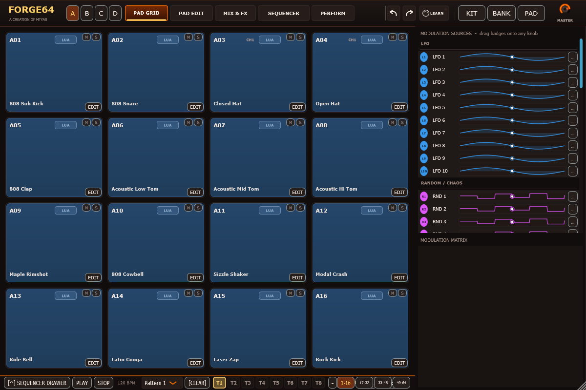
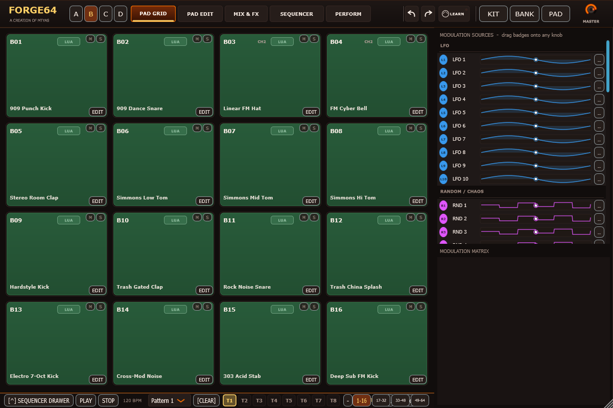
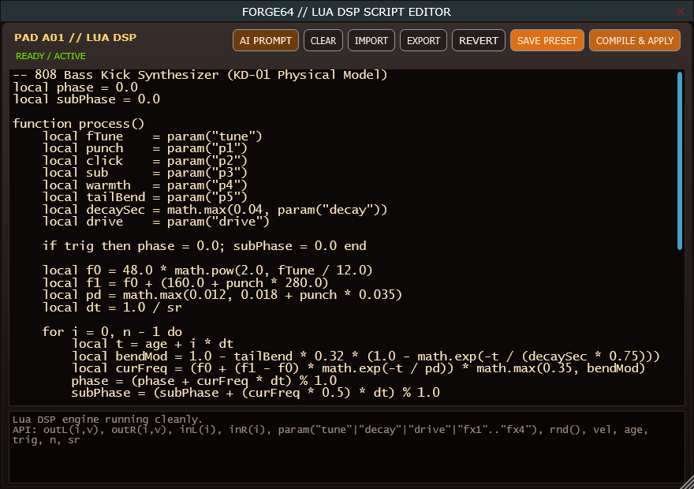
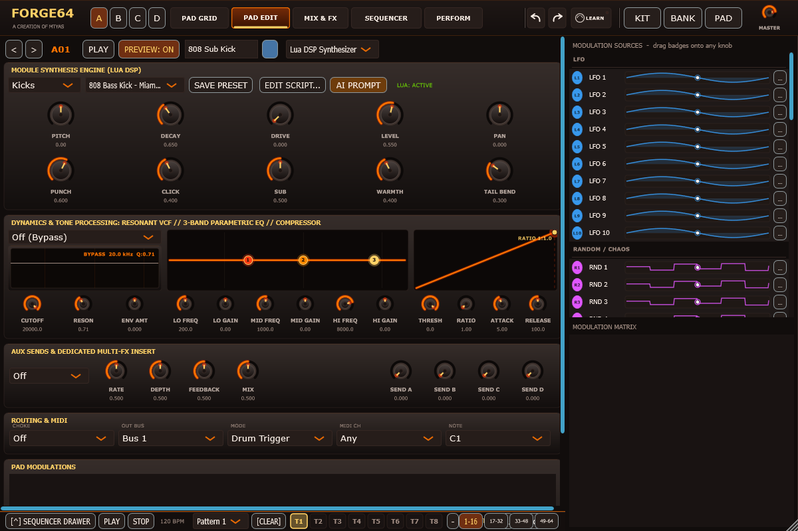
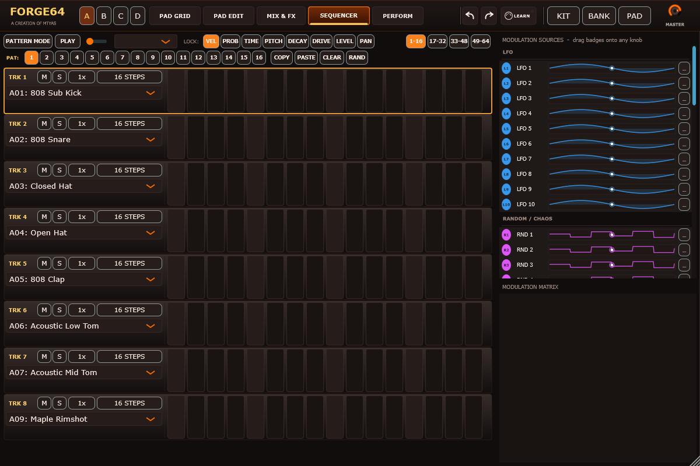
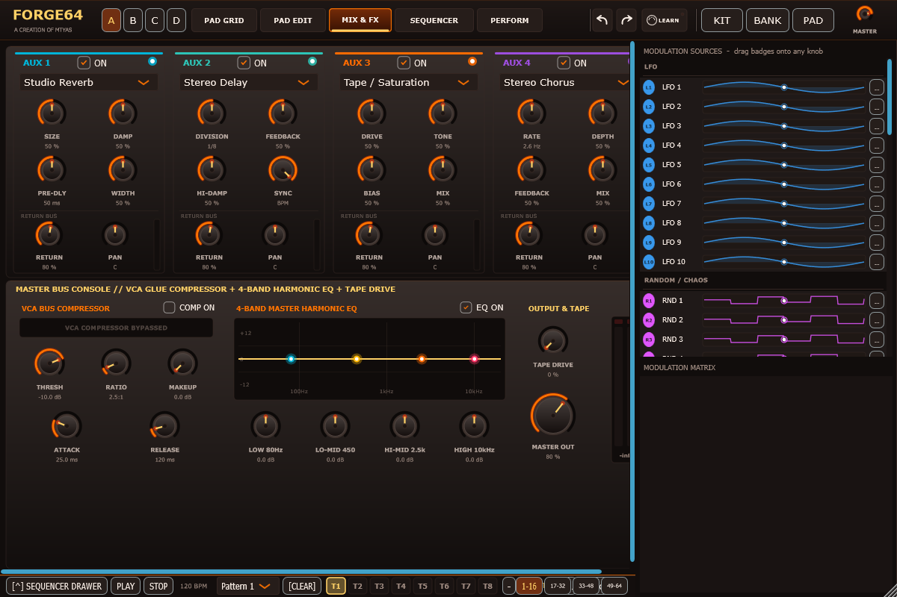

# FORGE64

**64-Pad Modular Drum Sampler & Live Lua DSP Synthesizer Workstation** | Created by **mtyas**

[](https://github.com/mtyas/FORGE64/releases/latest)
[](https://github.com/free-audio/clap)
[](LICENSE)
[]()
[](https://ko-fi.com/mtyas)

---

> ### ⚡ Quick Action & Links
> - [📥 **Download Pre-Built Binaries (Windows / macOS / Linux)**](https://github.com/mtyas/FORGE64/releases/latest)
> - [💻 **Live Lua 5.4 DSP Scripting & AI Prompting**](#-marquee-breakthrough-live-lua-54-dsp-scripting--ai-prompt-generator)
> - [🎛️ **Studio Ecosystem Routing (Pairs Well With)**](#-pairs-well-with-studio-ecosystem-synergy)
> - [🥁 **64-Pad Drum Matrix Breakdown**](#64-default-curated-pads-map)

---

## 🥁 Sonic Punch & Overview

### New in v0.95

- Loaded bank pads show their own named Lua DSP preset and retain their personal scripts.
- Right-click a sequencer lock button to reset that variable on the selected track or randomize it at 10–100% strength. Both actions support Undo and preserve the rhythm.
- Click the top-left FORGE64 logo for credits, version information, GPL v3 licence, and website, GitHub, and Ko-fi links.

**FORGE64** is a 64-pad modular drum workstation, procedural percussion synthesizer, and sequencing powerhouse built with modern C++20 and the JUCE 8 framework. 

Blending the immediate tactile workflow of classic MPC and Elektron hardware drum machines with 31 curated real-time mathematical DSP engines, FORGE64 creates punchy, organic, and aggressive drum grooves from scratch. From sub-shaking 808/909 kicks and acoustic Poisson-distribution snare wires to 48-mode physical modal cymbals, 303 acid lines, and Karplus-Strong string strikes, FORGE64 eliminates static sample fatigue.

---

## 🌟 Innovation Spotlight: Standout Breakthroughs

> [!IMPORTANT]
> ### 💻 Marquee Breakthrough: Live Lua 5.4 DSP Scripting & AI Prompt Generator
> Normally, testing a new synthesis algorithm or distortion curve requires writing C++, compiling the entire plugin, and reloading your DAW. **FORGE64 revolutionizes this workflow with an embedded Lua 5.4 DSP engine right on the faceplate**:
> - **Live Real-Time DSP Compilation**: Open the script editor, write raw DSP signal-processing code, and compile on the fly. The audio code executes in real time without stopping the beat or interrupting your session.
> - **Integrated AI Prompt Generator**: Describe a sound or mathematical formula in plain English (*"generate an asymmetric Chebyshev wavefolder that clips only the negative half-cycle with exponential decay"*), copy the generated prompt into your AI model, paste the script into FORGE64, and hear it immediately.
> - **Memory-Safe Audio Sandbox**: Protected by an instruction-quota limiter, preventing infinite loops or memory allocation from ever locking up your DAW's audio thread.

> [!TIP]
> ### 🔬 Advanced Physical Modeling Percussion Mechanics
> Rather than simple filtered noise bursts, FORGE64 calculates physical impact mechanics:
> - **48-Mode Modal Plate Cymbals**: Simulates 48 simultaneous vibrational modes on a hammered metal plate with non-linear strike deflection and rim choke.
> - **Poisson-Distribution Snare Wires**: Mathematical simulation of independent metal wires buzzing against a vibrating bottom drumhead with stochastic rebound physics.
> - **Acoustic Two-Mode Membrane Coupling**: Models the acoustic air cavity coupling between top batter head and resonant bottom head on kicks and toms.

---

<p align="center">
  
</p>

---

## 🎛️ Pairs Well With: Studio Ecosystem Synergy

FORGE64 is the rhythmic powerhouse of the **MTYAS Audio Suite**, designed to feed multi-domain processors and modular sequencers:

```
               +--------------------------------------+
               |          MidiFlux (Sequencer)        |
               | - Euclidean polyrhythms & ratchets   |
               | - Humanized micro-timing push/pull   |
               +-------------------+------------------+
                                   | Polyrhythmic MIDI Notes
                                   v
               +--------------------------------------+
               |          FORGE64 (Drum Workstation)  |
               | - 64 pads across 4 banks             |
               | - 16 dedicated stereo stem outputs   |
               | - Live Lua 5.4 DSP engines           |
               +-------------------+------------------+
                                   | Multi-Out Drum Stems (e.g. Kick Stem)
                                   v
               +--------------------------------------+
               |          OmniSplit (Audio FX)        |
               | - Surgical Transient click isolation |
               | - Pristine sub-bass body protection  |
               +--------------------------------------+
```

### 1. ✂️ FORGE64 $\to$ OmniSplit (Surgical Kick Stem Transient & Body Decoupling)
- **Why It Pairs**: Applying heavy overdrive, bitcrushing, or wavefolding to a full kick drum drum destroys the low-end sub-bass fundamental and creates muddy phase-cancellation in your mix.
- **Workflow**: Route FORGE64's **Kick Drum Out (Bus 1)** into **OmniSplit**. Activate OmniSplit's **Transient Splitter**:
  - **Attack (Transient Click)**: The instantaneous initial click of the beater hitting the drumhead dictates the rhythm. Route this stream into OmniSplit's *Chebyshev Wavefolder* or *Bitcrusher* to make the kick cut through a dense mix with razor-sharp definition.
  - **Body (Sustain Boom)**: The low-frequency 50 Hz sub boom dictates the groove. Keep this stream completely clean and uncompressed, locking the sub-bass foundation with flawless phase coherence.

### 2. 🎹 MidiFlux $\to$ FORGE64 (Generative Polyrhythms & Micro-Timing Grooves)
- **Why It Pairs**: FORGE64's 64 drum pads love dynamic trigger patterns.
- **Workflow**: Connect **MidiFlux** to FORGE64. Use MidiFlux's **Euclidean Block** and **Ratchet Block** to generate polyrhythmic African and Latin percussion grooves, while the **Humanizer** block injects micro-timing push/pull offsets (-50% to +50%) into FORGE64's snare and hi-hat pads.

---

## 📸 Visual Tour & Studio Architecture

| 64-Pad Grid (Bank A) | 64-Pad Grid (Bank B) |
|:---:|:---:|
|  |  |
| *Bank A: Core 808/909 electronic, acoustic kicks, snares, rimshots, and modal crash cymbals.* | *Bank B: Heavy industrial, hardstyle wavefolders, FM percussion, and 303 acid stabs.* |

| Embedded Lua 5.4 DSP Script Editor | Pad Dynamics & Multi-FX Sculpting |
|:---:|:---:|
|  |  |
| *Live DSP code editor with syntax highlighting, real-time compilation, and AI prompt generator.* | *Per-pad 5 macro knobs, 24dB resonant VCF, 3-band parametric EQ, VCA compressor, and 22 insert FX.* |

| Polyrhythmic Step Sequencer & P-Locks | Studio Mixing & Mastering Console |
|:---:|:---:|
|  |  |
| *8-track sequencer with Elektron-style parameter locks, microtiming, ratchets, and probability triggers.* | *16-bus stereo routing, 4 aux return processors (shimmer reverb, tape delay), and VCA bus glue compressor.* |

---

## 64 Default Curated Pads Map

FORGE64 loads with 64 individually tuned, distinct pads configured across 4 banks:

```
[ BANK A: Core Electronic & Acoustic ]
A01: 808 Sub Kick      A02: 808 Snare        A03: Closed Hat       A04: Open Hat
A05: 808 Clap          A06: Acoustic Low Tom A07: Acoustic Mid Tom A08: Acoustic Hi Tom
A09: Maple Rimshot     A10: 808 Cowbell      A11: Sizzle Shaker    A12: Modal Crash
A13: Ride Bell         A14: Latin Conga      A15: Laser Zap        A16: Rock Kick

[ BANK B: Heavy / Electro / Industrial Club ]
B01: 909 Punch Kick    B02: 909 Dance Snare  B03: Linear FM Hat    B04: FM Cyber Bell
B05: Stereo Room Clap  B06: Simmons Low Tom  B07: Simmons Mid Tom  B08: Simmons Hi Tom
B09: Hardstyle Kick    B10: Trash Gated Clap B11: Rock Noise Snare B12: Trash China Splash
B13: Electro 7-Oct Kick B14: Cross-Mod Noise B15: 303 Acid Stab    B16: Deep Sub FM Kick

[ BANK C: World & Acoustic Percussion ]
C01: Floor Tom Sub     C02: Studio Wood Rim  C03: Agogo High Bell  C04: Agogo Low Bell
C05: Conga Slap        C06: Conga Low Mute   C07: Hardwood Block Hi C08: Hardwood Block Lo
C09: High Disco Cowbell C10: Low Latin Cha-Cha C11: Pure Ride Ping C12: China Choke
C13: Fast Splash Wash  C14: Air Noise Shaker C15: Acoustic Snare Rim C16: 24-Inch Deep Bass

[ BANK D: Melodic Synths, Acid, Plucks & Cyber FX ]
D01: 303 Square Saw    D02: 303 Reso Acid    D03: Karplus String   D04: Metallic Pluck
D05: FM Marimba        D06: Bell Cluster     D07: Cybernetic Laser D08: Inharmonic Drone
D09: Tape Stop Snare   D10: Reverse Cymbal   D11: Granular Glitch  D12: Bitcrushed Drop
D13: Sub Drop 40Hz     D14: Sub Drop Sweep   D15: Dub Siren        D16: Noise Riser
```

---

## 📦 Downloads & Installation

Pre-compiled binary packages for **Windows**, **macOS** (Universal), and **Linux** are available on the [**Releases Page**](https://github.com/mtyas/FORGE64/releases):

| Format | Windows Destination | macOS Destination | Linux Destination |
| :--- | :--- | :--- | :--- |
| **VST3** | `C:\Program Files\Common Files\VST3\Forge64.vst3` | `/Library/Audio/Plug-Ins/VST3/Forge64.vst3` | `~/.vst3/Forge64.vst3` |
| **CLAP** | `C:\Program Files\Common Files\CLAP\Forge64.clap` | `/Library/Audio/Plug-Ins/CLAP/Forge64.clap` | `~/.clap/Forge64.clap` |
| **Standalone** | Any directory (`Forge64.exe`) | `/Applications/Forge64.app` | `/usr/local/bin/Forge64` |

---

## ⚙️ Architecture & Engineering Specifications

- **C++20 & JUCE 8 Framework**: Fully vector-optimized DSP pipeline.
- **Zero-Allocation Audio Thread**: Real-time memory safety ensures zero audio dropouts or buffer underruns at 32-sample buffer sizes.
- **Embedded Lua 5.4 Runtime**: Sandboxed real-time JIT-ready scripting environment.

### Building from Source

```bash
git clone --recursive https://github.com/mtyas/FORGE64.git
cd FORGE64
cmake -B build -DCMAKE_BUILD_TYPE=Release
cmake --build build --config Release -j
```

---

## ☕ Support & Community

If FORGE64 powers your productions, please consider supporting ongoing development:

[](https://ko-fi.com/mtyas)

---

## 📄 License

FORGE64 is licensed under the **GPLv3 License**.  
Crafted by **Matthew Tyas** ([mtyas](https://github.com/mtyas)).
