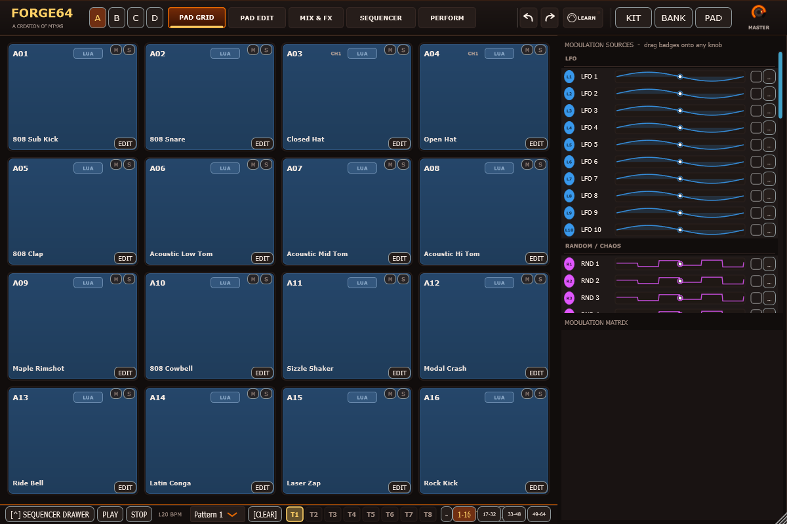
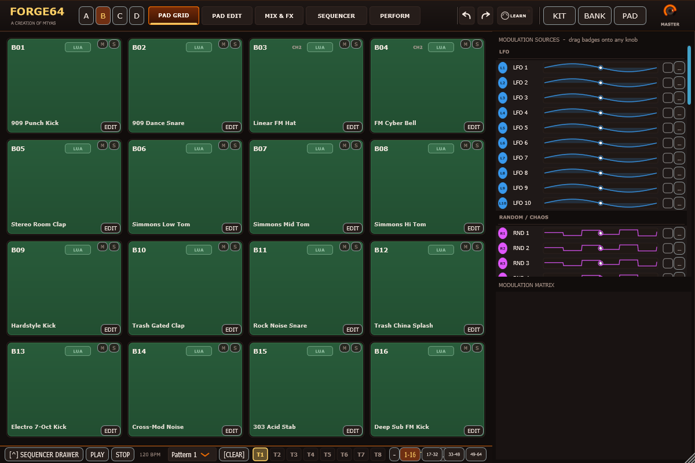
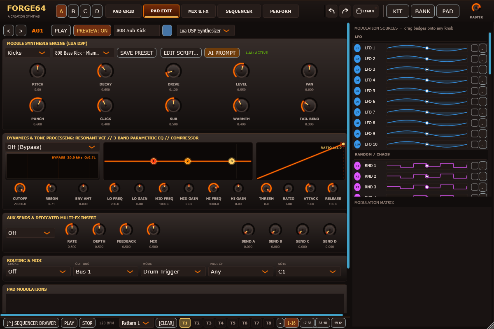
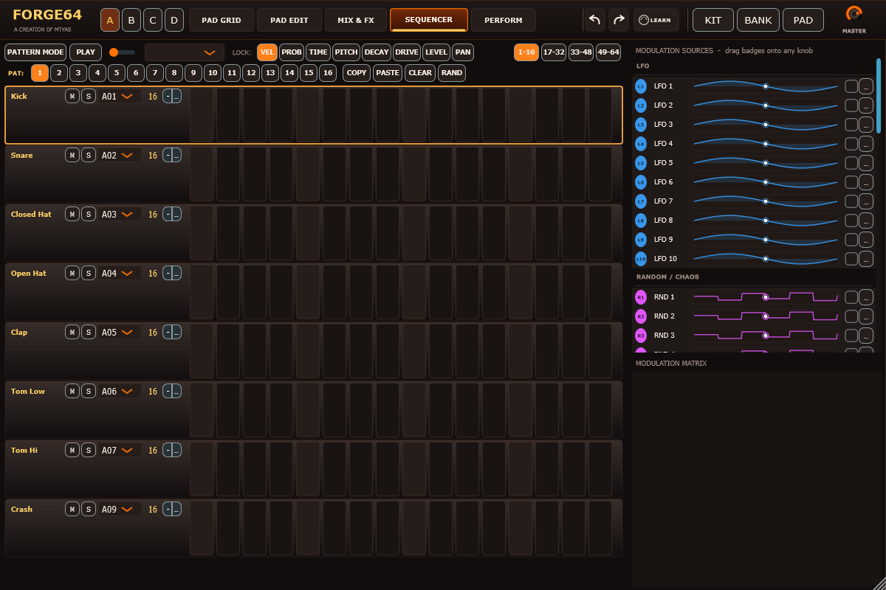
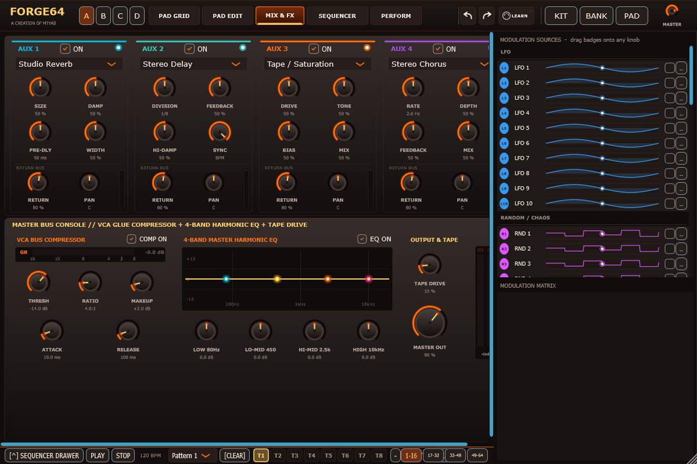
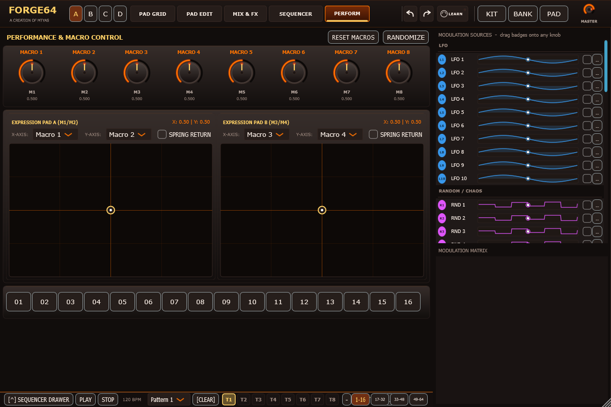
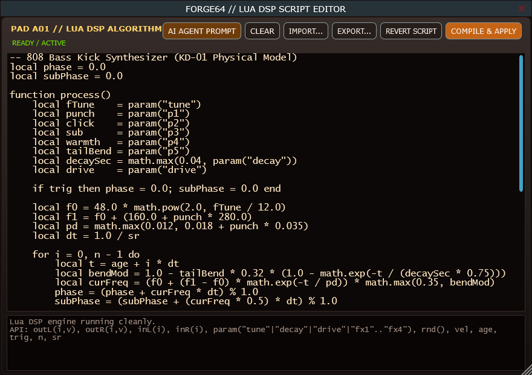

# FORGE64 User Manual

**Version 0.90 (Beta)** | Created by **Matthew Tyas (mtyas)**  
Support the project: [](https://ko-fi.com/mtyas)

---

## Table of Contents
1. [Introduction & Architectural Overview](#1-introduction--architectural-overview)
2. [Global Navigation & Workspace Top Bar](#2-global-navigation--workspace-top-bar)
3. [The 64-Pad Matrix & Bank System (Banks A–D)](#3-the-64-pad-matrix--bank-system-banks-ad)
4. [Pad Editor: Sound Sculpting & Voice Architecture](#4-pad-editor-sound-sculpting--voice-architecture)
   - [Lua DSP Synthesizer vs. Sample Engine](#lua-dsp-synthesizer-vs-sample-engine)
   - [5 Dynamic Macro Knobs (P1–P5)](#5-dynamic-macro-knobs-p1p5)
   - [Multimode Resonant VCF Filter](#multimode-resonant-vcf-filter)
   - [3-Band Draggable Parametric EQ](#3-band-draggable-parametric-eq)
   - [Analog-Modeled VCA Dynamics Compressor](#analog-modeled-vca-dynamics-compressor)
   - [22 Dedicated Insert Multi-FX](#22-dedicated-insert-multi-fx)
   - [Choke Groups & 16-Bus Multi-Out Routing](#choke-groups--16-bus-multi-out-routing)
5. [Polyrhythmic Step Sequencer & Song Arranger](#5-polyrhythmic-step-sequencer--song-arranger)
   - [Sequencer Architecture & Navigation](#sequencer-architecture--navigation)
   - [Polyrhythms & Independent Track Lengths](#polyrhythms--independent-track-lengths)
   - [Quick-Edit Lock Modes (Vel, Prob, Time, Pitch, Decay, Drive, Level, Pan)](#quick-edit-lock-modes)
   - [Deep Parameter Locks (P-Locks)](#deep-parameter-locks-p-locks)
   - [Song Mode & Arranger](#song-mode--arranger)
   - [Collapsible Sequencer Drawer](#collapsible-sequencer-drawer)
6. [Studio Mixing & Mastering Console (Mix & FX)](#6-studio-mixing--mastering-console-mix--fx)
   - [4 Independent Studio Aux Return Processors](#4-independent-studio-aux-return-processors)
   - [Tempo-Synced Delay & Division Tables](#tempo-synced-delay--division-tables)
   - [Shimmer Reverb, Spring Reverb & Gated Drums](#shimmer-reverb-spring-reverb--gated-drums)
   - [Master Bus Console: VCA Glue Compressor, 4-Band Harmonic EQ & Tape Drive](#master-bus-console)
7. [Live Performance & Macro Dashboard](#7-live-performance--macro-dashboard)
   - [Dual Interactive XY Expression Pads](#dual-interactive-xy-expression-pads)
   - [8 Global Performance Macros](#8-global-performance-macros)
   - [16-Pad Roll & Stutter Repeat Matrix](#16-pad-roll--stutter-repeat-matrix)
8. [53-Source Modulation Matrix & Live Visualizers](#8-53-source-modulation-matrix--live-visualizers)
   - [Live Waveform & Activity Monitoring](#live-waveform--activity-monitoring)
   - [LFOs, Lorenz Chaos, DAHDSR Envelopes, Mod Sequencers & MIDI](#modulation-sources)
   - [Drag-and-Drop Modulation Routing & Modulation Rings](#drag-and-drop-modulation-routing)
9. [Embedded Lua 5.4 DSP Script Editor & AI Prompt Generator](#9-embedded-lua-54-dsp-script-editor--ai-prompt-generator)
   - [Real-Time Audio Thread Safety (The Zero-Allocation Rule)](#real-time-audio-thread-safety)
   - [Lua DSP API Specification](#lua-dsp-api-specification)
   - [Using the Built-in AI Agent Prompt Generator](#using-the-built-in-ai-agent-prompt-generator)
10. [Preset Hierarchy & File Management (.kit, .bnk, .pad, .f64snd)](#10-preset-hierarchy--file-management)
11. [MIDI Implementation & MIDI Learn](#11-midi-implementation--midi-learn)
12. [Appendix: Complete Reference of 31 Factory DSP Modules](#12-appendix-complete-reference-of-31-factory-dsp-modules)

---

## 1. Introduction & Architectural Overview

**FORGE64** is a hybrid percussion workstation combining algorithmic procedural sound design, acoustic physical modeling, sample playback, and polyrhythmic sequencing into a unified, responsive instrument.

```
                    ┌──────────────────────────────────────────────┐
                    │               FORGE64 WORKSTATION            │
                    └──────────────────────┬───────────────────────┘
                                           │
         ┌───────────────────┬─────────────┴───────┬───────────────────┐
         ▼                   ▼                     ▼                   ▼
    [ PAD GRID ]       [ PAD EDITOR ]        [ SEQUENCER ]       [ MIX & FX ]
    64 Cells (4 Banks)  5-Macro Lua DSP       8-Track Polyrhythm  16 Stereo Buses
    Drag Sample Import  Resonant VCF          8 Lock Modes        4 Aux Return FX
    Choke & Bus Matrix  EQ / Comp / Multi-FX  Song Mode Arranger  Master Bus VCA
```

Every pad operates as an autonomous voice capable of running procedural Lua DSP scripts or streaming multi-channel audio samples through an analog-modeled processing chain (Multimode VCF, 3-band Parametric EQ, VCA Compressor, Analog Drive, and 22 Insert Multi-FX).

---

## 2. Global Navigation & Workspace Top Bar

The top header bar provides instant access to global navigation and session utilities:



- **Logo & Author Attribution**: Displays `FORGE64` and `A CREATION OF MTYAS`.
- **Bank Selectors (`A`, `B`, `C`, `D`)**: Selects the active 16-pad bank:
  - **Bank A (Pads 1–16)**: Core Electronic & Acoustic Drum Kit (808, 909, Toms, Cymbals, Rock Kick).
  - **Bank B (Pads 17–32)**: Heavy / Electro / Industrial Club (Hardstyle, Trash Claps, 303 Acid, Sub FM).
  - **Bank C (Pads 33–48)**: World & Acoustic Percussion (Congas, Agogos, Wood Blocks, Cowbells, Chinas).
  - **Bank D (Pads 49–64)**: Melodic Synths, Acid, Plucks & Cyber FX (Karplus-Strong, 303 Stabs, Zaps, Drones).
- **Navigation Tabs**:
  - `PAD GRID`: The 16-pad performance view with solo, mute, audition, and sample drop.
  - `PAD EDIT`: Focused deep-dive editor for sound design on the selected pad.
  - `MIX & FX`: Studio mixing console with 4 Aux Return racks and Master Bus processing.
  - `SEQUENCER`: 8-track polyrhythmic step sequencer with 8 lock modes and song arranger.
  - `PERFORM`: Dual XY expression pads, macro controls, and roll/stutter buttons.
- **Undo / Redo Icons (`↺` / `↻`)**: Comprehensive undo history stack for all parameter adjustments (`Ctrl+Z` / `Ctrl+Y`).
- **MIDI Learn Button (`LEARN`)**: Click to arm. Touch any on-screen knob or slider, then move your hardware MIDI controller to pair instantly.
- **Preset Buttons (`KIT`, `BANK`, `PAD`)**: Three-tier preset saving and loading (.kit, .bnk, .pad).
- **Master Level Knob**: Global output volume with animated modulation ring and peak clip detection.

---

## 3. The 64-Pad Matrix & Bank System (Banks A–D)

The Pad Grid provides immediate access to all 64 pads organized in four banks of 16 pads:



### Pad Operations
- **Audition Hit**: Left-click any pad to trigger a preview hit at standard velocity.
- **Select / Edit Pad**: Click `EDIT` on any pad to jump directly to the Pad Editor.
- **Mute / Solo (`M` / `S`)**: Mute or solo pads independently. Soloing overrides non-soloed pads.
- **Sample Drag & Drop**: Drag any `.wav`, `.aif`, `.flac`, or `.ogg` file from your desktop or file browser directly onto a pad to immediately switch it to sample playback.
- **Pad Copy (Alt + Drag)**: Hold `Alt` and drag one pad onto another to duplicate its entire sound design, parameters, and script.
- **Bank Colors**: Pads are color-coded per bank (Bank A: Steel Blue, Bank B: Forest Green, Bank C: Molten Amber, Bank D: Royal Purple) for instant visual orientation during live sessions.

---

## 4. Pad Editor: Sound Sculpting & Voice Architecture

The Pad Editor is a dedicated laboratory for per-pad sound design:



### Lua DSP Synthesizer vs. Sample Engine
Each pad can toggle between **Lua DSP Synthesizer** and **Sample Playback**:
- **Lua DSP Mode**: Sound is generated mathematically in real time with continuous parameter responsiveness and unlimited velocity dynamics.
- **Sample Mode**: Audio files are decoded with customizable start, end, loop points, reverse playback, and an ADSR amp envelope.

### 5 Dynamic Macro Knobs (P1–P5)
The 5 macro knobs dynamically adapt their labels, tooltips, and behavioral ranges according to the currently loaded DSP algorithm:
- On an **808 Kick**: `PUNCH`, `CLICK`, `SUB`, `WARMTH`, `TAIL BEND`.
- On an **Acoustic Snare**: `TENSION`, `CRACK`, `RIM HIT`, `SHELL RING`, `ROOM AIR`.
- On a **Modal Crash**: `BRIGHTNESS`, `SHIMMER`, `HIT POS`, `CHOKE/DAMP`, `WASH SPREAD`.
- In addition, **Pitch / Tune** (±24 semitones), **Decay**, and **Drive** provide core shaping across all modules.

### Multimode Resonant VCF Filter
- **Filter Modes**: `Bypass`, `24dB Lowpass`, `Highpass`, `Bandpass`, `Notch`.
- **Controls**: Cutoff (20 Hz – 20 kHz), Resonance (0.1 – 10.0), and Bipolar Envelope Amount (-1.0 to +1.0).
- Features an interactive frequency curve display showing cutoff slope and peak resonance.

### 3-Band Draggable Parametric EQ
- **Low Band**: Low Shelf with frequency (20 Hz – 2 kHz) and gain (±18 dB).
- **Mid Band**: Parametric Bell with frequency (100 Hz – 8 kHz) and gain (±18 dB).
- **High Band**: High Shelf with frequency (2 kHz – 16 kHz) and gain (±18 dB).
- Includes an interactive draggable frequency-response graph.

### Analog-Modeled VCA Dynamics Compressor
- **Controls**: Threshold (-60 dB to 0 dB), Ratio (1:1 to 20:1), Attack (0.1 ms – 100 ms), and Release (10 ms – 1000 ms).
- Interactive transfer characteristic plot displaying knee and compression slope.

### 22 Dedicated Insert Multi-FX
Choose between 22 studio-grade insert algorithms per pad:
1. **Flanger**: Jet flanging with feedback.
2. **Chorus**: Warm stereo ensemble chorus.
3. **Phaser**: Multi-stage analog phaser.
4. **Tremolo**: Optical amplitude modulation.
5. **Vibrato**: Pitch modulation.
6. **Auto-Pan**: Ping-pong stereo pan sweep.
7. **Ring Modulator**: Metallic sideband generator.
8. **Mono Delay**: Standard feedback echo.
9. **Stereo Ping-Pong Delay**: Alternating stereo echo.
10. **Filtered Dub Delay**: Resonant lowpass feedback delay.
11. **Room Reverb**: Intimate acoustic space.
12. **Plate Reverb**: Dense metal plate ambiance.
13. **Hall Reverb (8-Delay FDN)**: Deep concert hall.
14. **Shimmer Reverb**: Octave-pitch shifted ethereal bloom.
15. **Spring Reverb**: Electro-mechanical tank with boing and tension.
16. **Gated Reverb**: Thick non-linear 80s drum reverb.
17. **Bitcrusher**: Variable sample rate reduction and bit reduction.
18. **Overdrive**: Asymmetric diode clipping.
19. **Tube Saturator**: Triode vacuum-tube warmth and even-order harmonics.
20. **Wavefolder**: Multi-stage West Coast harmonic wavefolding.
21. **Frequency Shifter**: Quadrature Hilbert transform frequency shift.
22. **Stereo Detuner**: Dual-grain micro-pitch transposition.

### Choke Groups & 16-Bus Multi-Out Routing
- **16 Choke Groups**: Seamless 5ms click-free cross-fade choking across pads and banks (e.g. Closed Hat cutting Open Hat, Mute Conga cutting Open Conga).
- **16 Stereo DAW Buses**: Assign any pad to any of the 16 stereo output channels (`Bus 1` to `Bus 16`) for dedicated mixing in your DAW.
- **4 Aux Sends (`A`, `B`, `C`, `D`)**: Send dry signal post-insert into the studio Aux Return racks.

---

## 5. Polyrhythmic Step Sequencer & Song Arranger

The sequencer combines the step-by-step groove of iconic hardware beatboxes with deep parameter locking and polyrhythmic phasing:



### Sequencer Architecture & Navigation
- **8 Dedicated Tracks**: Each track triggers an assigned pad (from Pad 1 to Pad 64).
- **Transport**: Internal `PLAY` / `STOP`, tempo tracking, and `SWING` (50%–75%).
- **16 Patterns**: Quick switching between patterns `1` through `16`.
- **4-Page Navigation**: Jumps between 16-step pages: `1-16`, `17-32`, `33-48`, and `49-64`.
- **Clipboard Operations**: `COPY`, `PASTE`, `CLEAR`, and `RAND` (randomizes active track or all tracks).
- **Clean Initialization**: Sequencer initializes completely clean and empty by default.

### Polyrhythms & Independent Track Lengths
Each of the 8 tracks has an independent step length setting (**1 to 64 steps**). You can run:
- Track 1 (Kick): 16 steps
- Track 2 (Snare): 16 steps
- Track 3 (Hi-Hat): 14 steps
- Track 4 (Percussion): 7 steps
- Track 5 (Acid Bass): 15 steps  
This creates continuously evolving polyrhythms and polymetric phase relationships that never sound repetitive.

### Quick-Edit Lock Modes
The header row provides 8 color-coded lock edit buttons. Selecting a mode instantly changes the step sliders to edit that parameter directly on the step view:

| Button | Mode | Color Code | Description | Range |
| :--- | :--- | :--- | :--- | :--- |
| **VEL** | Velocity | Amber (`#FF9900`) | Step trigger velocity | 1% to 100% |
| **PROB** | Probability | Electric Blue (`#00B4D8`) | Chance that step triggers | 0% to 100% |
| **TIME** | Microtiming | Violet (`#B5179E`) | Sub-sample timing shift | -50% to +50% |
| **PITCH** | Pitch Offset | Goldenrod (`#FFB703`) | Semitone offset for hit | -24 to +24 st |
| **DECAY** | Decay Length | Mint Green (`#06D6A0`) | Override decay time | 0.01s to 6.0s |
| **DRIVE** | Drive Amount | Flame Orange (`#FF5400`) | Saturation level | 0% to 100% |
| **LEVEL** | Pad Level | Coral (`#EF476F`) | Gain trim | 0% to 100% |
| **PAN** | Stereo Pan | Cyan (`#48CAE4`) | Stereo placement | 100% L to 100% R |

### Deep Parameter Locks (P-Locks)
Hold `Ctrl` and click any step in the sequencer to enter **P-Lock Mode**:
- The step button illuminates in active lock mode.
- Any knob or parameter moved on the Pad Editor while P-Lock is active will latch exclusively to that step!
- The step sequencer executes these locked values with sample-accurate precision when the playhead hits that step.

### Song Mode & Arranger
Click `PATTERN MODE` to switch into `SONG MODE`:
- Arrange full songs by queuing pattern blocks with independent repeat counters.
- Supports intro, verse, chorus, bridge, and drop arrangements without touching your DAW's linear timeline.

### Collapsible Sequencer Drawer
Located at the bottom of the plugin window, the **Sequencer Drawer** can be expanded at any time using `[^] SEQUENCER DRAWER`, allowing you to program beats while staying on the Pad Grid, Pad Editor, or Mix & FX pages!

---

## 6. Studio Mixing & Mastering Console (Mix & FX)

The Mix & FX page combines a 4-channel studio Aux FX rack with an analog-modeled master bus console:



### 4 Independent Studio Aux Return Processors
Each of the 4 Aux channels features dedicated bypass, effect type dropdown, 4 primary parameter knobs, Return Level, Return Pan, and an output VU meter.

Choose between **14 Studio Algorithms**:
1. **Studio Reverb**: Rich algorithmic stereo plate/room.
2. **Stereo Delay**: Dual tempo-synced or free-running delay with cross-damping.
3. **Tape / Saturation**: Warm analog tape compression and soft clipping.
4. **Stereo Chorus**: Multi-voice ensemble chorus.
5. **Jet Flanger**: Comb-filter flanger with negative feedback.
6. **Multi Phaser**: 8-stage phasing with resonant sweep.
7. **Bus Compressor**: VCA stereo bus compressor.
8. **Resonant Filter**: Multimode filter with Cutoff, Resonance, Mode (LP/BP/HP), and Drive saturation.
9. **Shimmer Reverb**: Expansive pitch-shifted reverb tank with endless 10+ second bloom.
10. **Ping-Pong Delay**: Bouncing stereo echo with independent damping.
11. **Gated Drum Reverb**: Thick 80s gated reverb with adjustable gate time (40ms to 2.5s) and tone.
12. **Tube Warmth**: Vacuum-tube saturation with even/odd harmonic bias.
13. **Pitch Shifter**: Full chromatic transposition (-12 to +12 semitones) with fine cents detuning and feedback.
14. **Spring Reverb**: Dual-tank electro-mechanical spring with tension, boing, and tone damping.

### Tempo-Synced Delay & Division Tables
For both **Stereo Delay** and **Ping-Pong Delay**, turning `SYNC` to `BPM` changes the first knob from `TIME` (in milliseconds) to `DIVISION`, displaying musical divisions cleanly:

$$\text{1/32} \;\to\; \text{1/16T} \;\to\; \text{1/16} \;\to\; \text{1/8T} \;\to\; \text{1/16D} \;\to\; \text{1/8} \;\to\; \text{1/4T} \;\to\; \text{1/8D} \;\to\; \text{1/4} \;\to\; \text{1/4D} \;\to\; \text{1/2} \;\to\; \text{1/2D}$$

### Shimmer Reverb, Spring Reverb & Gated Drums
- **Shimmer Reverb**: Re-engineered with high-feedback tank injection and soft limiting. Turning the shimmer knob high retains full tail decay without collapsing.
- **Spring Reverb**: Recreates the classic boing and acoustic resonance of dual mechanical springs.
- **Gated Reverb**: Perfect for punchy Phil Collins-style gated snares and kicks with adjustable decay envelope.

### Master Bus Console
- **VCA Glue Compressor**: Solid-state bus compressor modeled after legendary British consoles. Features gain-reduction metering (GR meter), Threshold (-40 to 0 dB), Ratio (1:1 to 20:1), Makeup Gain (0 to 18 dB), Attack (0.1 to 100 ms), and Release (10 to 1000 ms).
- **4-Band Harmonic Master EQ**: Low (80 Hz shelf), Low-Mid (450 Hz bell), High-Mid (2.5 kHz bell), and High (10 kHz shelf) with ±12 dB gain and interactive response curve.
- **Master Tape Drive**: Asymmetric tape saturation for analog cohesion.
- **Output Peak Meter**: Stereo peak meter with clip hold LEDs and dBFS readout.

---

## 7. Live Performance & Macro Dashboard

The Performance page provides live stage controls for dynamic manipulation:



### Dual Interactive XY Expression Pads
- **XY Pad 1 & XY Pad 2**: Draggable pucks with physics inertia and spring-back return.
- Assign X and Y axes to any synthesis parameter, filter cutoff, pitch, or aux send.

### 8 Global Performance Macros
- Dedicated macro knobs (`M1` to `M8`) linked to multiple pad parameters simultaneously via the modulation matrix.

### 16-Pad Roll & Stutter Repeat Matrix
- Dedicated roll buttons for instant stutter fills: 1/4, 1/8, 1/16, 1/32, 1/64, triplets, and dotted rhythms with velocity pressure sensitivity.

---

## 8. 53-Source Modulation Matrix & Live Visualizers

FORGE64 features a modular modulation engine with 53 simultaneous modulation sources:

### Live Waveform & Activity Monitoring
The right side panel displays live real-time visualizers for all modulation sources:
- **10 Multi-Wave LFOs**: Live sinusoidal/sawtooth oscilloscope traces.
- **4 Chaos & Random Generators**: Live chaotic step and smoothed random traces (including Lorenz 3D Attractor dynamics).
- **10 DAHDSR Envelopes**: Live attack-hold-decay envelope plots.
- **10 Modulation Sequencers**: Live 16-step sequence plots.
- **8 Global Macros & MIDI Sources**: Live level bars.

### Drag-and-Drop Modulation Routing
- Click and drag any modulation source badge (e.g. `L1`, `R1`, `E1`) directly onto any knob or slider on the interface to create a connection.
- Each modulated knob displays a colored modulation ring showing current depth, modulation range, and live modulated value.
- Right-click any knob to view, edit, or delete existing modulation routings.

---

## 9. Embedded Lua 5.4 DSP Script Editor & AI Prompt Generator

FORGE64 features a built-in code editor for authoring custom procedural audio modules:



### Real-Time Audio Thread Safety (The Zero-Allocation Rule)
1. **Never allocate tables `{}` inside `process()`**: Memory allocation on the audio thread invokes the garbage collector, causing audio dropouts.
2. Pre-allocate all state variables, oscillators, filter coefficients, and buffer tables at module scope outside `process()`.
3. Every script execution is bounded by an automatic **instruction watchdog hook** (4,000,000 instructions on init, 8,000,000 in `process()`) so infinite loops can never hang your DAW.

### Lua DSP API Specification
```lua
-- Global variables provided per audio block:
n     -- Integer block size in samples (64, 128, 256, 512)
sr    -- Float sample rate in Hz (44100.0, 48000.0, 96000.0)
vel   -- Float trigger velocity (0.01 to 1.0)
age   -- Float hit age in seconds since trigger onset
trig  -- Boolean true ONLY on the first block of a hit
note  -- Integer MIDI note number (0 to 127)

-- Audio buffer access:
outL(i, sample)  -- Write left channel sample (-1.0 to 1.0)
outR(i, sample)  -- Write right channel sample (-1.0 to 1.0)
inL(i)           -- Read incoming left audio sample
inR(i)           -- Read incoming right audio sample

-- Parameters:
param("tune")    -- Semitones pitch offset (-24.0 to +24.0)
param("decay")   -- Decay time in seconds (0.005 to 8.0)
param("drive")   -- Saturation amount (0.0 to 1.0)
param("p1")      -- Macro 1 knob (0.0 to 1.0)
param("p2")      -- Macro 2 knob (0.0 to 1.0)
param("p3")      -- Macro 3 knob (0.0 to 1.0)
param("p4")      -- Macro 4 knob (0.0 to 1.0)
param("p5")      -- Macro 5 knob (0.0 to 1.0)
param("level")   -- Pad output level (0.0 to 1.0)
param("pan")     -- Pad stereo pan (-1.0 to +1.0)

-- Fast Math:
rnd()            -- Fast uniform PRNG [0.0, 1.0)
sin, cos, tan, exp, log, tanh, abs, min, max, clamp
```

### Using the Built-in AI Agent Prompt Generator
Click the **AI AGENT PROMPT** button inside the Lua Editor or Pad Editor:
- The complete master prompt is automatically copied to your clipboard.
- Paste this prompt into Claude, ChatGPT, Gemini, or Antigravity to generate new physical drum models, synthesized instruments, or modular sound engines fully compliant with FORGE64!

---

## 10. Preset Hierarchy & File Management

FORGE64 features a three-tier XML preset architecture:

1. **Kit Presets (`.kit`)**: Captures the entire state of the workstation:
   - All 64 pads (all parameters, Lua scripts, and sample references).
   - All 53 modulation sources and matrix connection routings.
   - 4 Aux Return racks and Master Bus settings.
   - Step sequencer patterns and song arrangements.
2. **Bank Presets (`.bnk`)**: Saves or loads an individual 16-pad bank (`A`, `B`, `C`, or `D`).
3. **Pad Presets (`.pad`)**: Saves or loads a single pad's complete sound design, filter settings, insert FX, and Lua code.
4. **Sound Presets (`.f64snd`)**: Lightweight parameter snapshots for individual modules. Over 150 factory presets are included out of the box!

---

## 11. MIDI Implementation & MIDI Learn

- **MIDI Note Mapping**: Pads map chromatically from MIDI Note 36 (C1 = Pad 1) up to Note 99 (D#6 = Pad 64).
- **MIDI Channels**: Set globally or per-pad (Omni, Channels 1–16).
- **MIDI CC Learn**: Touch the `LEARN` button in the header bar. Touch any knob, move any physical CC controller, and it is instantly bound.
- **Velocity Sensitivity**: Full 128-level velocity response with non-linear acoustic velocity curve mapping.

---

## 12. Appendix: Complete Reference of 31 Factory DSP Modules

| Category | Module ID | Name | Core Architecture | Macros P1–P5 |
| :--- | :--- | :--- | :--- | :--- |
| **Kicks** | `kick_808` | 808 Bass Kick | KD-01 Resonant Bridged-T | PUNCH, CLICK, SUB, WARMTH, TAIL BEND |
| | `kick_909` | 909 Dance Kick | BD-02 Dual-VCO Punch | ATTACK, PUNCH, BODY TUNE, SNAP, DRIVE |
| | `kick_rock` | Acoustic Rock Kick | 24-inch Maple Shell | BEATER, HEAD RESO, SHELL DAMP, ROOM, WARMTH |
| | `kick_electro` | Electro 7-Oct Kick | Fast Exponential Pitch Sweep | SWEEP, CLICK TONE, SUB BASS, CRUSH, RESO |
| | `kick_hardstyle` | Hardstyle Raw Kick | Wavefolded Distorted Punch | PUNCH, WAVE FOLD, SUB TAIL, CRUNCH, BARK |
| | `kick_sub_fm` | Deep Sub FM Kick | 2-Operator Phase Modulator | FM DEPTH, MOD RATIO, SUB LEVEL, DRIVE, GLIDE |
| **Snares** | `snare_808` | 808 Analog Snare | Twin-T Bandpass + White Noise | SNAPPY, TONE, BODY, NOISE DEC, COLOR |
| | `snare_909` | 909 Dance Snare | Dual-Tone Resonator + Noise | TUNE, TONE, SNAPPY, DECAY, ATTACK |
| | `snare_rock` | Rock Acoustic Snare | Poisson Snare Wire Model | WIRE TENSION, CRACK, RIM STRIKE, RING, AIR |
| | `snare_rimshot` | Maple Rimshot | Resonant Acoustic Wood Block | STICK, SHELL PING, DAMPING, HOLLOW, BRIGHT |
| **Hi-Hats** | `hat_closed` | 808 Closed Hat | 6-Schmitt Trigger Metallic XOR | METALLIC, TIGHTNESS, SIZZLE, CHOKE, BRIGHT |
| | `hat_open` | 808 Open Hat | 6-Schmitt Trigger Bandpass | SIZZLE, RESO, RING, CHOKE, SHIMMER |
| | `hat_fm` | Linear FM Hat | Inharmonic 3-Op FM Cluster | FM DEPTH, MOD RATIO, HARMONICS, TILT, SPREAD |
| | `hat_noise` | Organic Shaker / Hat | Filtered White Noise Generator | FILTER CUT, RESO, SHAKER, DENSITY, STEREO |
| **Claps** | `clap_808` | 808 Hand Clap | Triple-Burst Trigger Envelope | FLAM, HAND COUNT, TAIL NOISE, ROOM, SNAP |
| | `clap_room` | Stereo Room Clap | Multi-Tap Diffused Acoustic | STEREO WIDTH, ROOM SIZE, PRE-DLY, DAMP, BRIGHT |
| | `clap_trash` | Trash Gated Clap | Bitcrushed Digital Clap | CRUSH, CLATTER, GATE TIME, DRIVE, RESO |
| **Toms** | `tom_dual` | Analog Dual Tom | Tuned Membrane with Pitch Drop | TENSION, BEND, BOTTOM HEAD, RING, STRIKE |
| | `tom_simmons` | Simmons SDS-V Tom | Iconic 80s Hexagon Space Tom | PITCH DROP, CLICK, NOISE MIX, RESO, DECAY |
| | `tom_floor` | Acoustic Floor Tom | Deep 16-inch Resonant Shell | SUB WEIGHT, HEAD DAMP, SHELL SIZE, BOOM, THUMP |
| **Cymbals** | `cymbal_crash` | Modal Plate Crash | 64-Mode Non-Linear Resonator | BRIGHT, SHIMMER, HIT POS, DAMPING, SPREAD |
| | `cymbal_ride` | Acoustic Ride Bell | Dual-Mode Bronze Inharmonic | BELL PING, WASH, BRONZE TONE, SIZZLE, DAMP |
| | `cymbal_china` | Trash China Splash | Asymmetric Hammered Cymbal | TRASH BITE, CLATTER, METALLIC, CHOKE, SPREAD |
| **Percussion** | `perc_cowbell` | 808 Dual Cowbell | Twin Square Wave Bandpass | TONE RATIO, DAMPING, CLICK, RING, BRIGHT |
| | `perc_conga` | Latin Quinto / Conga | Acoustic Shell with Hand Slap | SLAP/OPEN, HEAD PITCH, SHELL DAMP, AIR, STRIKE |
| | `perc_agogo` | Brazilian Agogo Bell | Dual Pitched Bell Resonator | LOW/HIGH, TONE, CLACK, RESO, DECAY |
| | `perc_rimshot` | Wood Block / Clave | High Q Acoustic Hardwood | WOOD TONE, CHAMBER, IMPACT, HOLLOW, DAMP |
| **Synths** | `synth_zap` | Sci-Fi Laser Zap | Exponential Downward Chirp | SWEEP, RESO, DEPTH, PULSE, STEREO |
| | `synth_acid` | 303 Acid Bass / Lead | Diode Ladder Filtered Saw/Square | CUTOFF, RESO, ENV MOD, DECAY, ACCENT |
| | `synth_noise` | Cross-Mod Noise FM | Cross-Modulated Chaotic Noise | MOD FREQ, FEEDBACK, CHAOS, BANDWIDTH, DENSITY |
| | `synth_karplus` | Karplus-Strong Pluck | Waveguide String Model | PLUCK BRIGHT, DAMPING, BODY SIZE, STRING, POS |

---

Developed with passion by **Matthew Tyas (mtyas)**.  
Licensed under **GPL v3.0**. Support ongoing development at [Ko-fi](https://ko-fi.com/mtyas).
